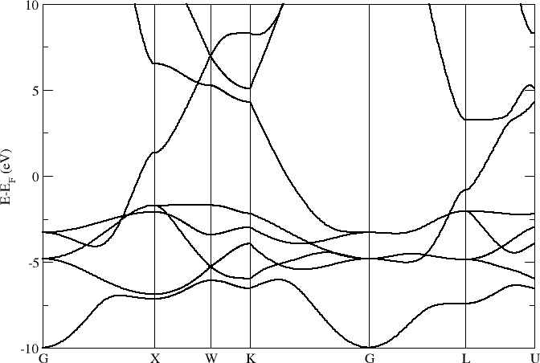
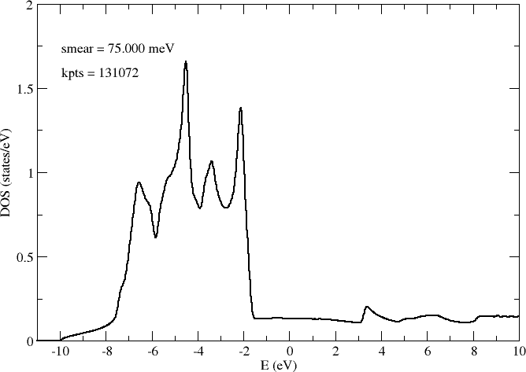
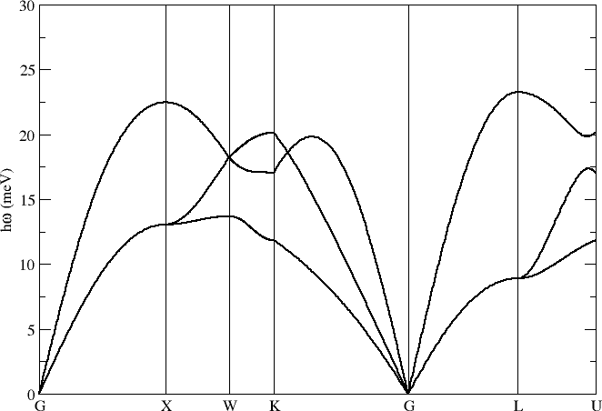
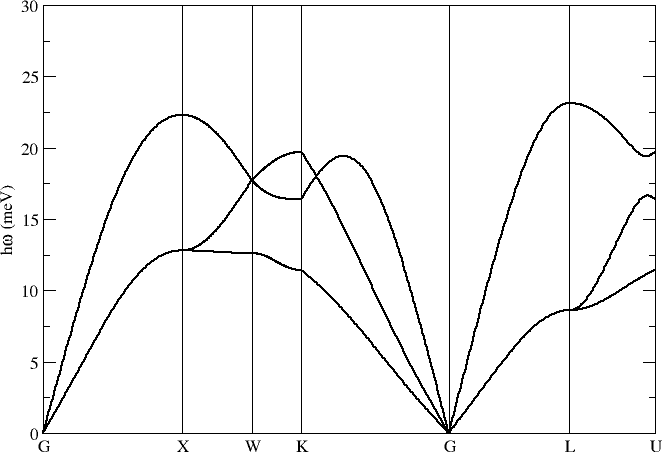
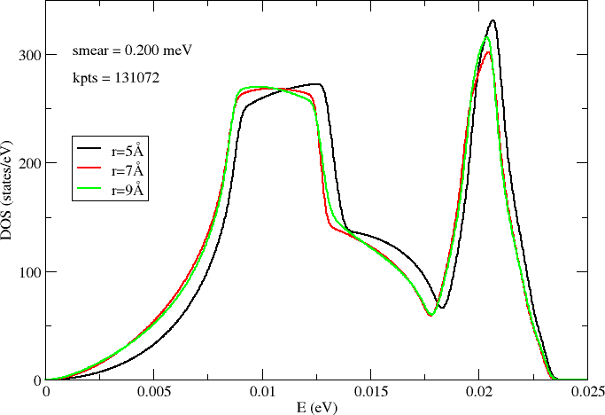
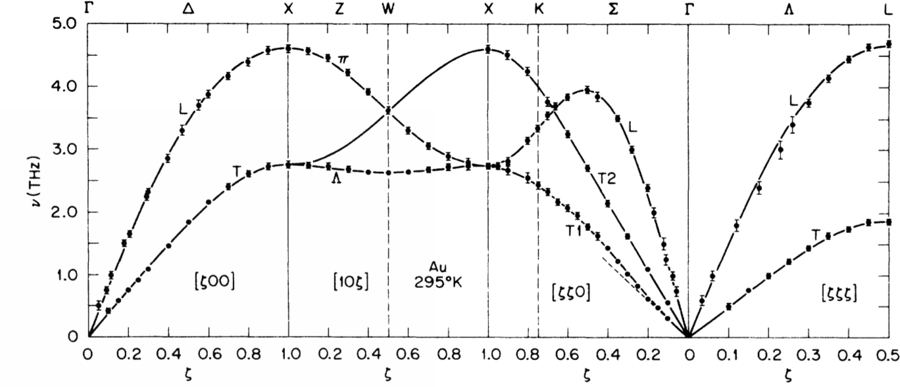

.. _au_fcc:

Au FCC
------

Phonon band structure for Au (see `Examples/Phonon_bands/Au_FCC`).

Lattice parameter a = 4.08 Å and a 6x6x6 repetition of the primitive cell. Main computational settings:

.. code-block:: bash

    PAO.EnergyShift 0.01 Ry
    PAO.BasisSize   DZP
    XC.functional   GGA
    XC.authors      PBE
    MeshCutoff      500. Ry
    MD.FCDispl      0.02 Ang

Electrons
~~~~~~~~~

**Band structure**

**Desity of states**

Density of states (DOS) sampled on a grid of 64x64x64 k-points:

Phonons
~~~~~~~

**Band structure**

Phonon band structure computed with different force cutoff radii r = 5.0, 7.0, 9.0 Å:

**Desity of states**

Density of states (DOS) sampled on a grid of 64x64x64 k-points:

Reference results
~~~~~~~~~~~~~~~~~

Lynn, J. W.; Smith, H. G. & Nicklow, R. M. `Lattice-dynamics of gold <https://journals.aps.org/prb/abstract/10.1103/PhysRevB.8.3493>`_, Phys. Rev B **8**, 3493-3499 (1973).

