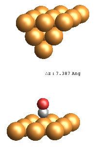
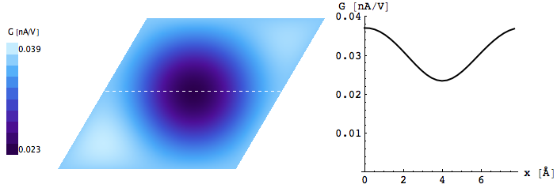
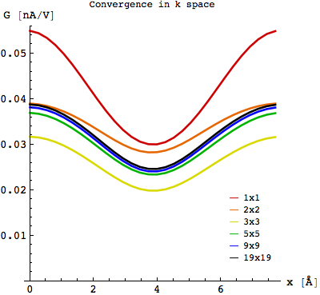

.. _co_cu111:

CO/Cu(111)
----------

In this example we describe how to obtain STM images of a CO molecule adsorbed on a Cu(111) surface consisting of 3x3 Cu atoms with lattice constant 2.57 Å, using 5x5 k points along the surface plane. The vertical distance between the oxygen atom and the tip-apex copper atom is 7.4 Ang. (See /Examples/COatCu111-Cutip-3x3surf/) 

.. code-block:: bash

   #TranSiesta:
   XC.functional   GGA
   XC.authors      PBE
   MeshCutoff      200. Ry        
   PAO.EnergyShift 0.001 Ry       
   PAO.BasisSize   SZP   #C and O DZP

   #STM command:
   STM -F 64 -L 87 -n 1 -x 5 -y 5 STM5x5

STM image
~~~~~~

**Geometry**

Relaxed geometry of the STM device region:

**k averaged STM image**

The k averaged STM image and its cross-section conductance:

**Images of individual k points**

STM images of individual k points along the surface plane:

.. image:: results/STMimage_CO_at_Cu111_kspace.png
   :scale: 80 %
   :alt: 
   :align: center

Convergence in k space
~~~~~~

Cross-section profiles using different number of k points in the surface plane:

	  
