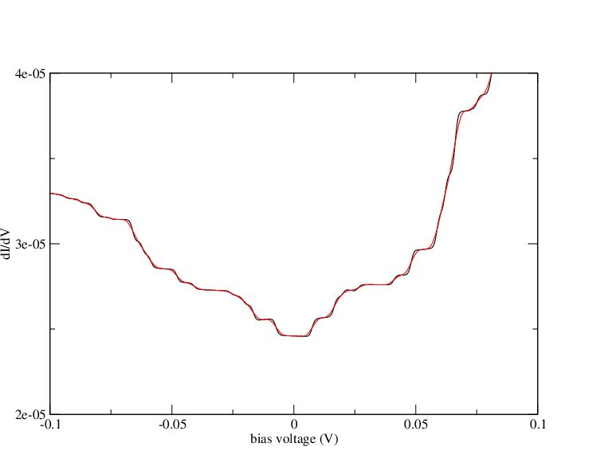
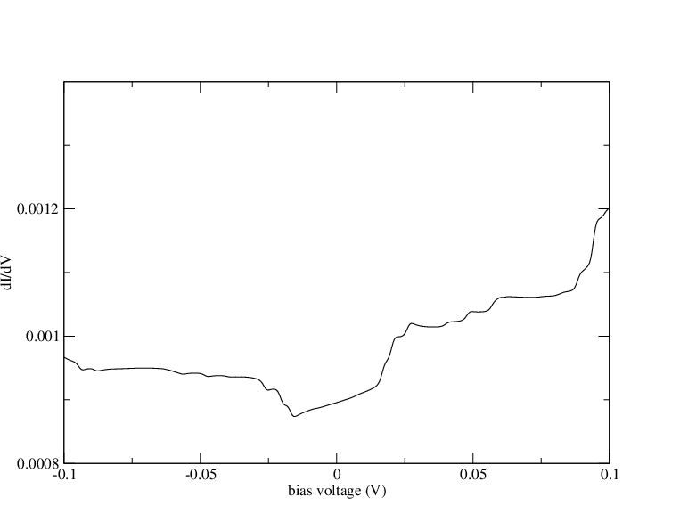

.. _graphene_sic:

Graphene/SiC
------------

In this example we describe how to obtain the IETS signatures
of the interfacial phonon observed in epitaxial graphene on SiC
reported in `this publication <https://link.aps.org/doi/10.1103/PhysRevB.96.155431>`_:

.. code-block:: bash

    @Article{minamitani,
      author = {Minamitani, E. and Arafune, R. and Frederiksen, T. and Suzuki, T. and Shahed, S. M. F. and Kobayashi, T. and Endo, N. and Fukidome, H. and Watanabe, S. and Komeda, T.},
      title = {Atomic-scale characterization of the interfacial phonon in graphene/SiC},
      journal = {Phys. Rev. B},
      year = {2017},
      volume = {96},
      pages = {155431},
      Doi = {10.1103/PhysRevB.96.155431},
      url = {https://link.aps.org/doi/10.1103/PhysRevB.96.155431},
    }

Virtual crystal approximation
~~~~~~~~~~~~~~~~~~~~~~~~~~~~~

IETS
~~~~

Reference results:

	  
