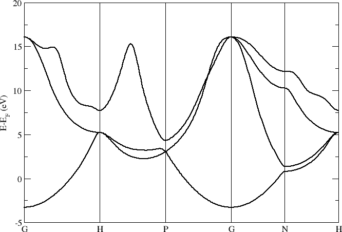
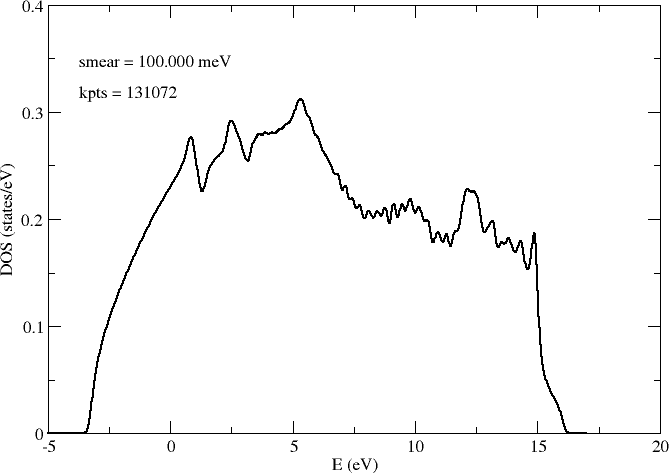
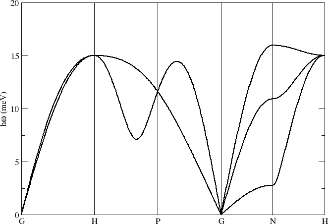
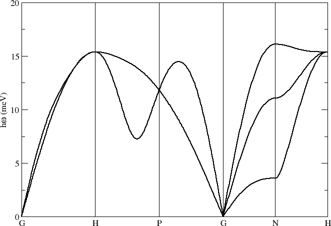
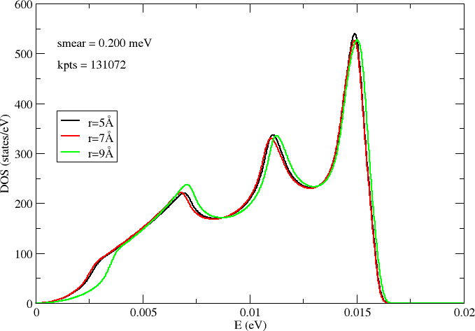
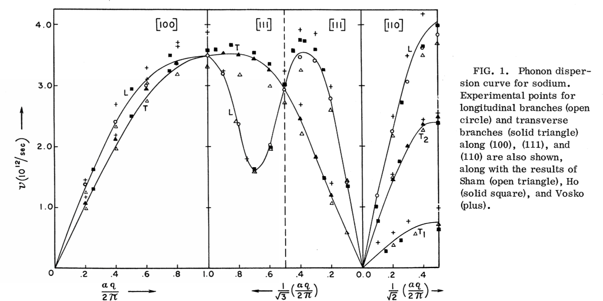

.. _na_bcc:

Na BCC
------

Phonon band structure for Na BCC (see `Examples/Phonon_bands/Na_BCC`).

Lattice parameter a = 4.23 Å and a 7x7x7 repetition of the primitive cell. Main computational settings:

.. code-block:: bash

    PAO.EnergyShift 0.01 Ry
    PAO.BasisSize   DZP
    XC.functional   GGA
    XC.authors      PBE
    MeshCutoff      500. Ry
    MD.FCDispl      0.02 Ang

Electrons
~~~~~~~~~

**Band structure**

**Desity of states**

Density of states (DOS) sampled on a grid of 64x64x64 k-points:

Phonons
~~~~~~~

**Band structure**

Phonon band structure computed with different force cutoff radii r = 5.0, 7.0, 9.0 Å:

.. image:: results/NaBCC_r7.0_Phonons.png
   :scale: 80 %
   :alt: phonon band structure with force cutoff radii of 7.0 angstroms
   :align: center

**Desity of states**

Density of states (DOS) sampled on a grid of 64x64x64 k-points:

Reference results
~~~~~~~~~~~~~~~~~

Kushwaha, S. S. & Rajput, J. S. `Phonon dispersion relation of body-centered-cubic Metals <http://journals.aps.org/prb/abstract/10.1103/PhysRevB.2.3943>`_, Phys. Rev. **B** 2, 3943 (1970).

