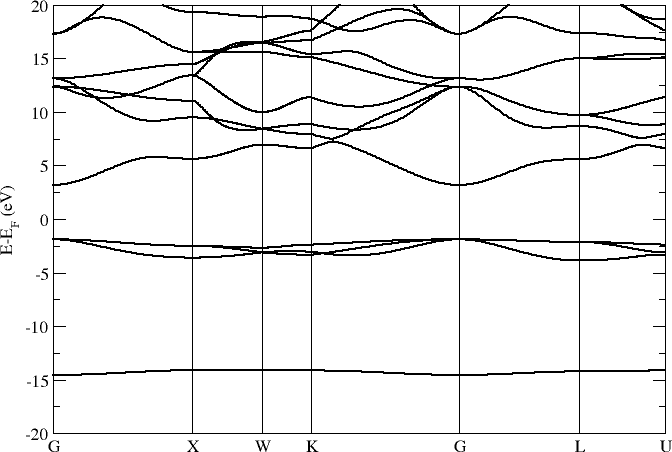
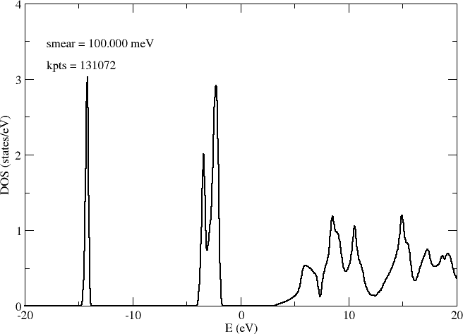
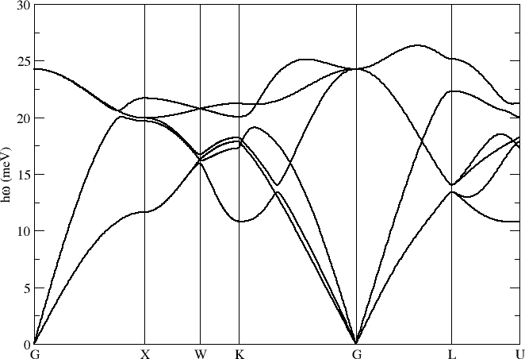
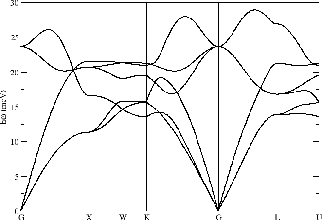
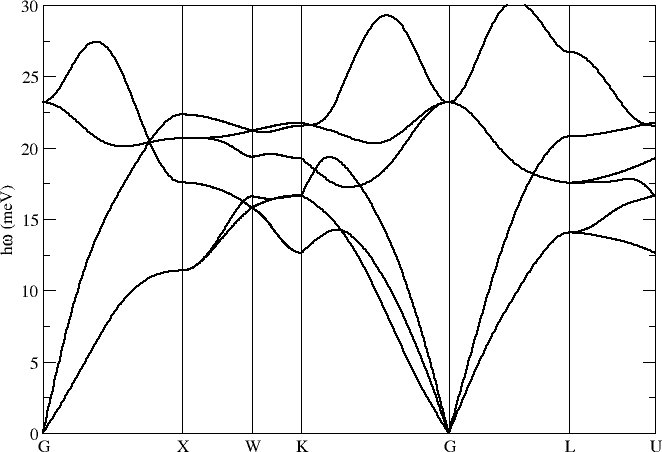
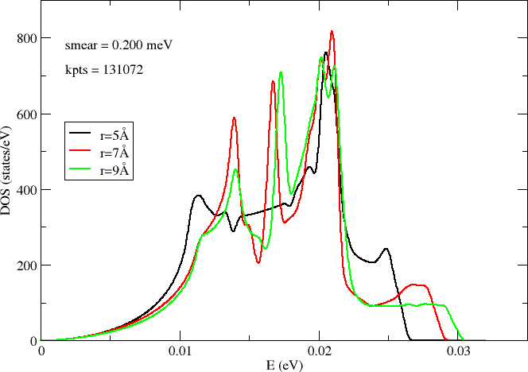
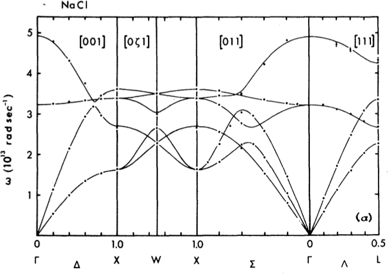

.. _nacl:

NaCl
----

Phonon band structure for NaCl (see `Examples/Phonon_bands/NaCl`).

Lattice parameter a = 5.64 Å and a 6x6x6 repetition of the primitive cell. Main computational settings:

.. code-block:: bash

    PAO.EnergyShift 0.01 Ry
    PAO.BasisSize   DZP
    XC.functional   GGA
    XC.authors      PBE
    MeshCutoff      500. Ry
    MD.FCDispl      0.02 Ang

Electrons
~~~~~~~~~

**Band structure**

**Desity of states**

Density of states (DOS) sampled on a grid of 64x64x64 k-points:

Phonons
~~~~~~~

**Band structure**

Phonon band structure computed with different force cutoff radii r = 5.0, 7.0, 9.0 Å:

**Desity of states**

Density of states (DOS) sampled on a grid of 64x64x64 k-points:

Reference results
~~~~~~~~~~~~~~~~~

One important difference is the modes at *Gamma*. With `Inelastica <docs_>`_ the optical modes are found to be degenerate. The missing LO-TO splitting is likely the effect of macroscopic polarization in polar materials. The long-range electrostatic interactions are not corrected in the current code revisions.

Raunio, G. & Rolandson, S. `Lattice Dynamics of NaCl, KCl, RbCl, and RbF <http://journals.aps.org/prb/abstract/10.1103/PhysRevB.2.2098>`_, Phys. Rev. B **2**, 2098 (1970).
